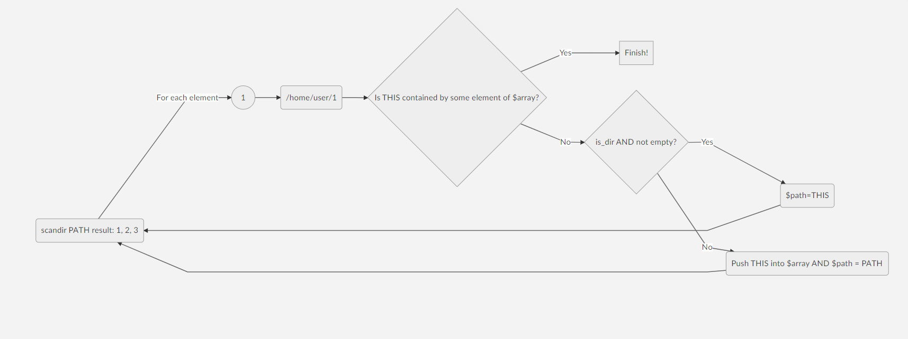

# Storehouse
> React project with MDB to manage local machine files.

|TO DO            |DOING                         |DONE                        |
|----------------|-------------------------------|-----------------------------|
|`Encapsulate all ajax calls`|`Fixing API listFiles.php`|`Asynchronous forEach`|
|`Merge Functions.js component into API`||`API Create Folders`|
|`Apply basic styles`||`API Delete Files`|
|`Fix render in incomplete asynchronous response`|

### listFiles.php (building):
```php
$array = array();
define('PATH', '/home/user');
```


