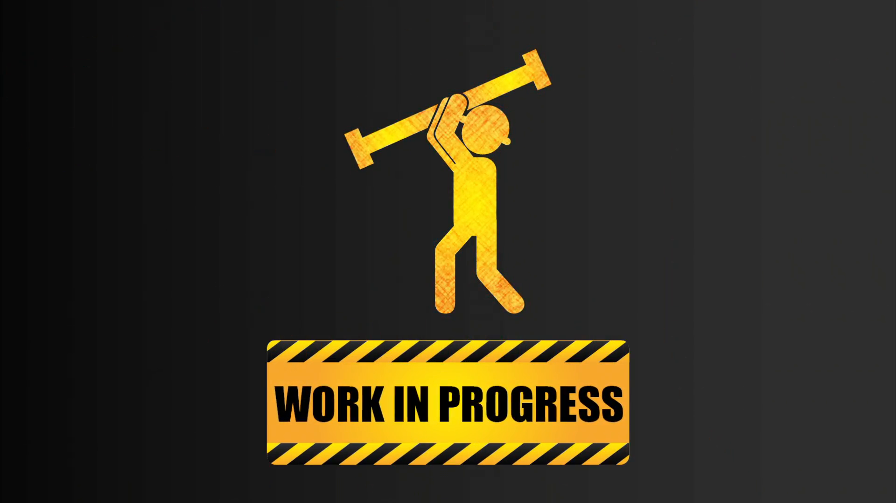

# Storehouse
> React project with MDB to manage local machine files.

|TO DO            |DOING                         |DONE                        |
|----------------|-------------------------------|-----------------------------|
|`IT tests`|`Unit tests`|`Asynchronous forEach`|
|||`API Create Folders`|
|||`API Delete Files`|
|||`Fix API listFiles.php`
|||`Event render of Loading`
|||`Apply basic styles`
|||`Encapsulate mapModified`
|||`Merge Functions.js component into API`
|||`Encapsulate all ajax calls`
|||`End API functions`
|||`Fix API renameElement`
|||`Fix render in incomplete asynchronous response`
|||`Fix CSS import for test`

